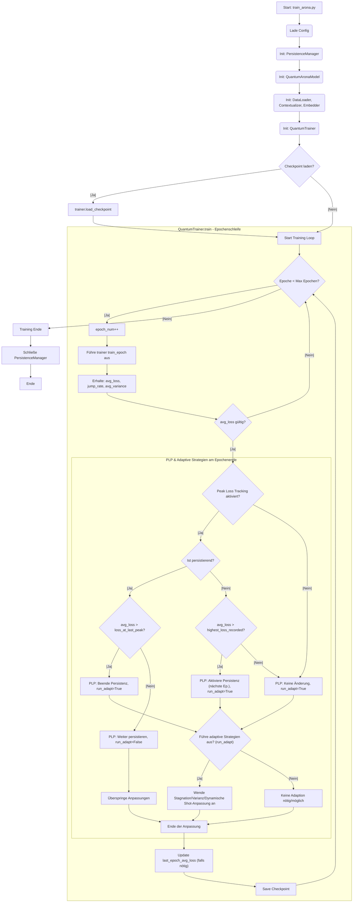
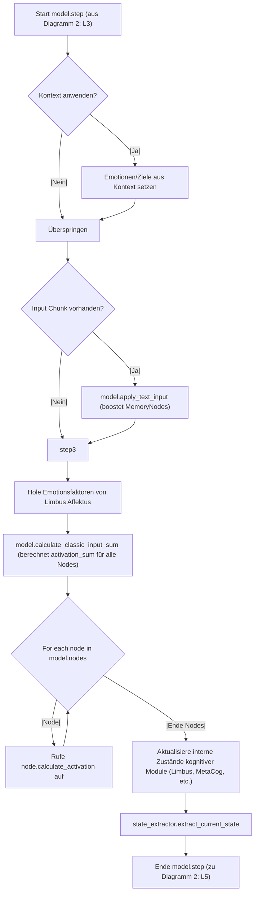
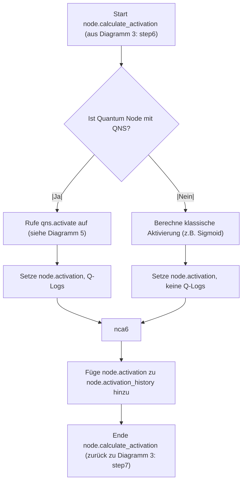
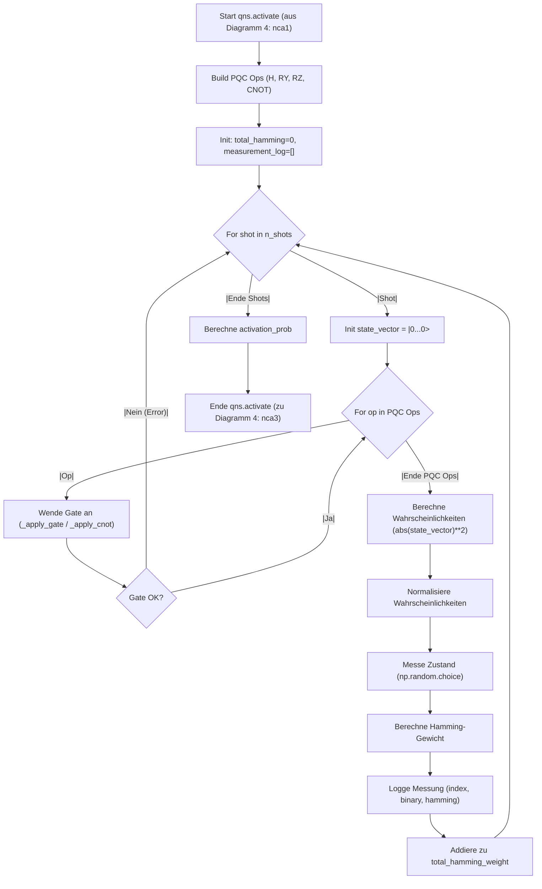
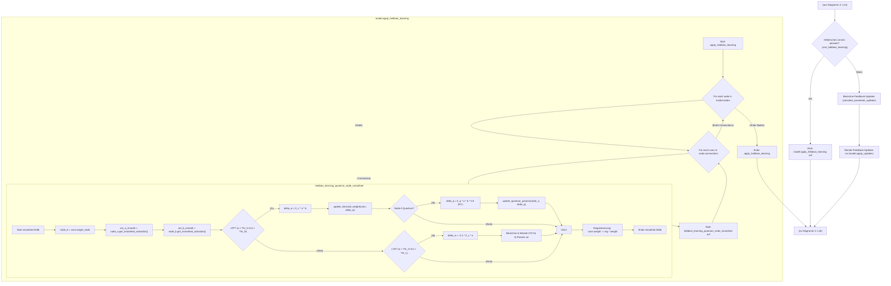

## Diagramm 1: Gesamtüberblick Trainingsprozess (QuantumTrainer.train)

---

---
## Diagramm 2: Ablauf einer einzelnen Epoche (QuantumTrainer.train_epoch)

```mermaid
graph TD
    L_Start["Start train_epoch (aus Diagramm 1: K)"] --> L0["Init: total_loss=0, etc."]
    L0 --> L1{"For each chunk_data in DataLoader.generate_chunks"}
    L1 --|Chunk|--> L1a{"Ist persistierend? (Trainer-Status)"}
    L1a --|Ja|--> L2b["effective_shots = current_n_shots"]
    L1a --|Nein|--> L2a{"Random Shots aktiviert?"}
    L2a --|Ja|--> L2a_1["Berechne random shot_noise"]
    L2a_1 --> L2b["effective_shots = clip(current_n_shots + shot_noise)"]
    L2a --|Nein|--> L2b

    L2b --> L3["contextualizer.add_context"]
    L3 --> L4["Führe model.step aus (siehe Diagramm 3)"]
    L4 --> L5["Erhalte current_state"]
    L5 --> L6["target_state = _get_target_state(context)"]
    L6 --> L7["_calculate_feedback"]
    L7 --> L7a["Erhalte: overall_feedback, feedback_comps"]
    L7a --> L7b["loss = 1 - (overall_feedback + 1)/2"]
    L7b --> L8["Analysiere Sprünge & Varianz aus current_state"]
    L8 --> L8a["Sammle chunk_variances für Epochen-Statistik"]
    L8a --> L9{"Loss gültig?"}
    L9 --|Nein|--> L1 

    L9 --|Ja|--> L9a["Berechne loss_delta"]
    L9a --> L9b["Akkumuliere total_loss, processed_chunks++"]
    L9b --> L10["calculate_dynamic_learning_rates"]
    L10 --> L10a["Erhalte: dyn_lr_c, dyn_lr_q"]
    L10a --> L11{"Jump Boost aktiviert?"}
    L11 --|Ja|--> L12["Berechne boost_factor basierend auf chunk_max_jump"]
    L12 --> L12a["boosted_lr_q = dyn_lr_q * boost_factor"]
    L11 --|Nein|--> L13["boosted_lr_q = dyn_lr_q"]
    L12a --> L13

    L13 --> L14{"Hebb'sches Lernen aktiviert?"}
    L14 --|Ja|--> L15["Wende Hebb'sches Lernen an (siehe Diagramm 6)"] 
    L14 --|Nein|--> L16["Berechne Feedback-basierte Updates (calculate_parameter_updates)"]
    L16 --> L17["Wende Feedback-Updates an (model.apply_updates)"]

    L15 --> L18
    L17 --> L18

    L18 --> L19{"MetaCognitio vorhanden?"}
    L19 --|Ja|--> L20{"Sprung erkannt UND Loss verbessert?"}
    L20 --|Ja|--> L21["meta_cog.log_reflection"]
    L20 --|Nein|--> L22
    L19 --|Nein|--> L22

    L21 --> L22
    L22 --> L23{"Logging Intervall erreicht?"}
    L23 --|Ja|--> L24["embedder.embed_state"]
    L24 --> L25["persistence_manager.log_chunk_result"]
    L25 --> L26
    L23 --|Nein|--> L26

    L26 --> L27{"TQDM aktiv?"}
    L27 --|Ja|--> L28["Aktualisiere TQDM Postfix"]
    L28 --> L1 
    L27 --|Nein|--> L1 

    L1 --|Ende Chunks|--> L_End["Ende train_epoch (zu Diagramm 1: M)"]

```

---

---
## Diagramm 3: Ablauf eines Modellschritts (QuantumAronaModel.step)

---

---
## Diagramm 4: Ablauf der Knotenaktivierung (Node.calculate_activation)

---

---
## Diagramm 5: Ablauf der Quantensimulation (QuantumNodeSystem.activate)

---

---
## Diagramm 6: Ablauf der Lernregelanwendung (Fokus auf Hebb)

